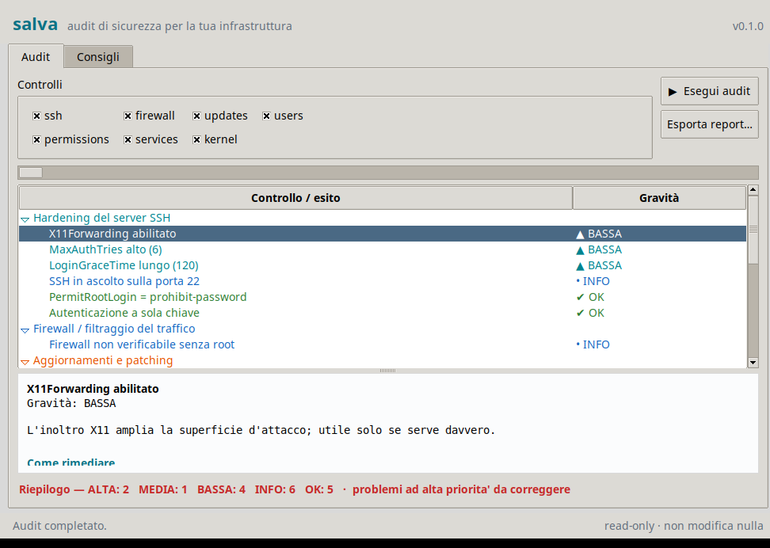

# salva

**Assistente per la messa in sicurezza di infrastrutture Linux.** Parte dai
consigli e poi fa un audit *read-only* della macchina, segnalando i problemi con
gravità e rimedio concreto.

Zero dipendenze: solo la libreria standard di Python (≥ 3.9). `salva` **non
modifica nulla** — legge la configurazione e ti dice cosa e come correggere.

Due interfacce sullo stesso motore: **riga di comando** (`salva check`) e
**interfaccia grafica** (`salva gui`, basata su Tkinter — anch'essa senza
dipendenze esterne).



## Uso rapido

```bash
# senza installare (dalla cartella del progetto)
python3 -m salva            # schermata iniziale con 3 consigli e i comandi
python3 -m salva advice     # tutti i consigli, per area
python3 -m salva advice rete
python3 -m salva check      # audit read-only di questa macchina
sudo python3 -m salva check # audit completo (accede a shadow, firewall, ...)
python3 -m salva gui        # interfaccia grafica (richiede Tk: apt install python3-tk)
```

Oppure con il wrapper eseguibile:

```bash
./bin/salva check
```

O installandolo (crea il comando `salva`):

```bash
pipx install .    # oppure: pip install --user .
salva check
```

## Condividere lo strumento

Ci sono due modi, con un compromesso diverso.

### 1. File singolo `.pyz` — un file solo, gira su Linux/macOS/Windows

È l'opzione **"un file solo, ovunque"**. Costruiscilo con:

```bash
python3 build.py        # genera dist/salva.pyz (~20 KiB)
```

Poi **condividi solo `dist/salva.pyz`**. Chi lo riceve lo esegue così:

```bash
python3 salva.pyz check        # Linux / macOS / Windows (con Python 3)
./salva.pyz check              # Linux / macOS, dopo: chmod +x salva.pyz
py salva.pyz check             # Windows (Python launcher)
```

**Requisito:** sul computer di destinazione serve **Python 3** (già presente su
quasi tutte le Linux; su macOS/Windows può richiedere un'installazione). Nessuna
libreria esterna: solo la standard library.

### 2. Binari nativi — zero-Python, ma un file per ogni sistema operativo

Un eseguibile nativo **non richiede Python**, ma è legato al suo OS: ne serve uno
per Linux, uno per macOS e uno per Windows. Non è possibile produrli tutti da una
sola macchina, quindi conviene farli generare dalla CI.

- **Binari pronti:** già compilati nella pagina
  [Releases](https://github.com/etamponi/salva/releases). Per ogni sistema c'è
  la versione a riga di comando e quella grafica:
  - CLI: `salva-linux-x86_64`, `salva-macos-arm64`, `salva-windows-x86_64.exe`
  - GUI: `salva-gui-linux-x86_64`, `salva-gui-macos-arm64`, `salva-gui-windows-x86_64.exe`
- **Automatico (consigliato):** il workflow `.github/workflows/build.yml` compila
  i tre binari in parallelo su GitHub Actions (PyInstaller, `--onefile`). Avvialo
  a mano dalla tab *Actions*, oppure pusha un tag `v*` per allegarli a una release.
- **A mano su una singola piattaforma** (produci il binario per l'OS su cui sei):

  ```bash
  pip install pyinstaller
  pyinstaller --onefile --name salva --paths . salva_main.py
  # risultato: dist/salva  (dist/salva.exe su Windows)
  ```

| | file singolo `.pyz` | binari nativi |
|---|---|---|
| Numero di file | **1**, per tutti gli OS | 3 (uno per OS) |
| Serve Python sul target | sì | **no** |
| Dimensione | ~20 KiB | ~6–10 MiB per file |
| Come si costruisce | `python3 build.py` | CI o PyInstaller per OS |

**In pratica:** per condividere velocemente con colleghi che hanno Python, usa il
`.pyz`. Per distribuire a chi non ha (né vuole) Python, usa i binari nativi.

## Comandi

| Comando | Cosa fa |
|---|---|
| `salva` | schermata iniziale: tre consigli di partenza + elenco comandi |
| `salva advice [area]` | best practice curate; `area` opzionale (`accessi`, `rete`, `patching`, `privilegi`, `dati`, `monitoraggio`, `hardening`, `processo`) |
| `salva check` | esegue tutti i controlli e stampa un report con riepilogo |
| `salva check --only ssh,firewall` | esegue solo i controlli scelti |
| `salva check --json` | output machine-readable (per cron/CI/dashboard) |
| `salva gui` | apre l'interfaccia grafica (audit + consigli in finestra) |
| `salva list-checks` | elenca i controlli disponibili |

## Controlli (tutti read-only)

- **ssh** — hardening di `sshd_config`: root login, password auth, password vuote,
  protocollo, X11, MaxAuthTries, LoginGraceTime, porta.
- **firewall** — presenza di un firewall attivo (ufw / nftables / iptables).
- **updates** — aggiornamenti in sospeso, patch di sicurezza, riavvio richiesto,
  aggiornamenti automatici.
- **users** — account UID 0 anomali, password vuote, account interattivi.
- **permissions** — permessi di file sensibili (`shadow`, `passwd`, chiavi host
  SSH) e file world-writable in `/etc`.
- **services** — porte TCP in ascolto esposte alla rete, con allerta sui servizi
  rischiosi (DB, Redis, Telnet, RDP…).
- **kernel** — parametri sysctl di hardening (syncookies, ASLR, rp_filter,
  ICMP redirect…).

## Codice di uscita

Pensato per l'automazione:

- `0` — nessun problema serio (al massimo INFO/OK)
- `1` — problemi di gravità bassa/media
- `2` — problemi di gravità alta o critica

Esempio in cron (report giornaliero solo se qualcosa non va):

```bash
0 7 * * * /usr/bin/salva check --json > /var/log/salva-$(date +\%F).json || \
  mail -s "salva: problemi rilevati" admin@example.com < /var/log/salva-$(date +\%F).json
```

## Come estenderlo

Ogni controllo è una sottoclasse di `Check` in `salva/checks/` che ritorna una
lista di `Finding` (con `Severity`, dettaglio e rimedio). Per aggiungerne uno:
crea il modulo, poi registralo in `salva/checks/__init__.py` (`ALL_CHECKS`).

> `salva` è un aiuto, non un sostituto di un hardening completo. Per una baseline
> formale segui un CIS Benchmark o una DISA STIG per la tua distribuzione.
